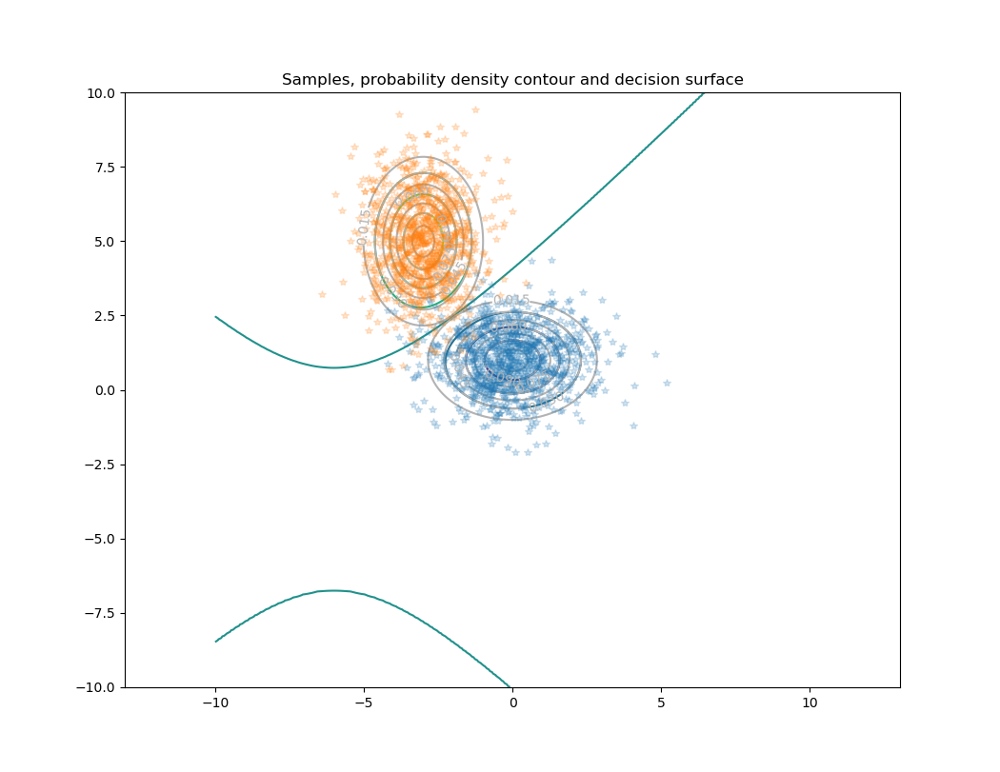
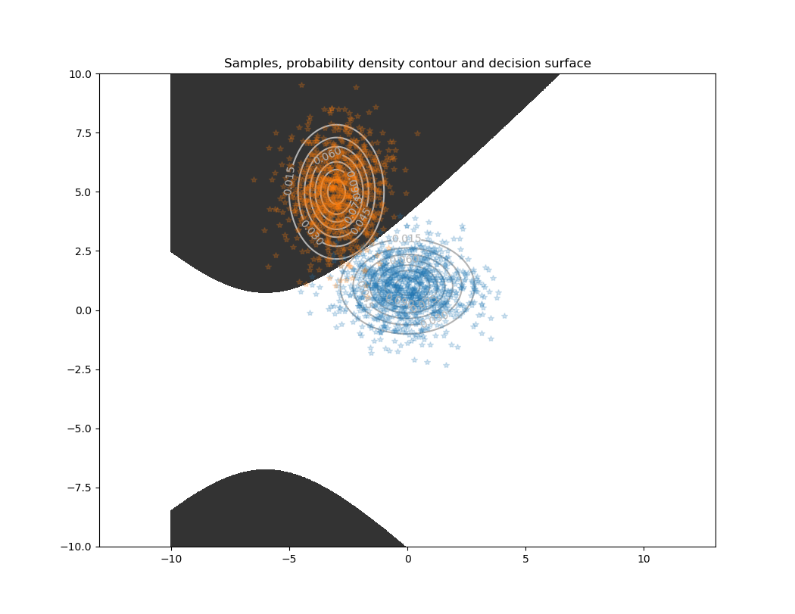
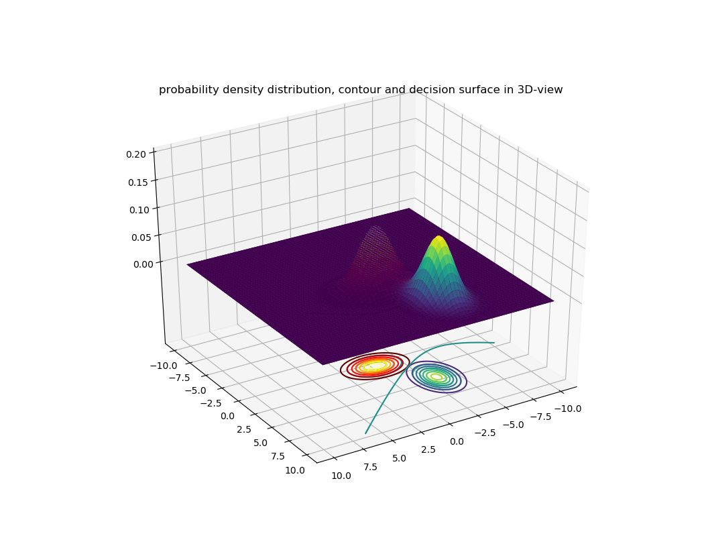
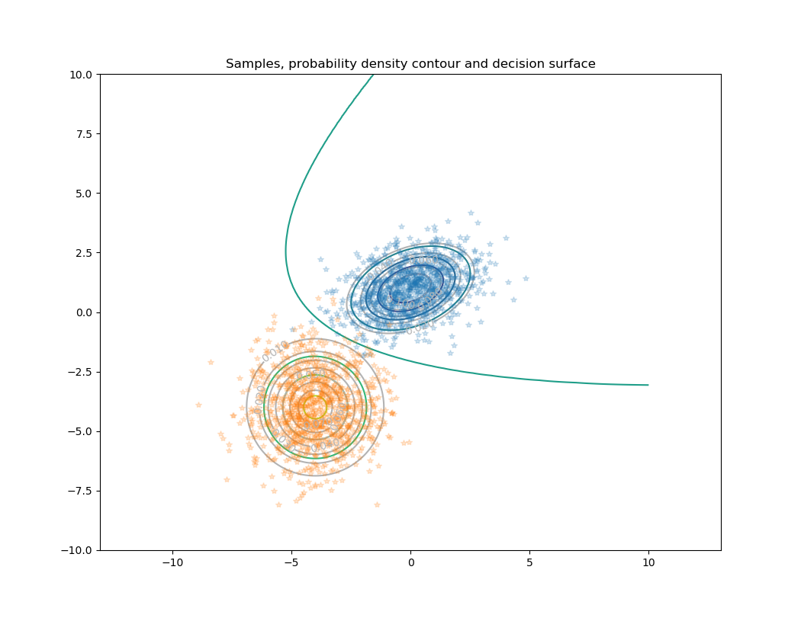
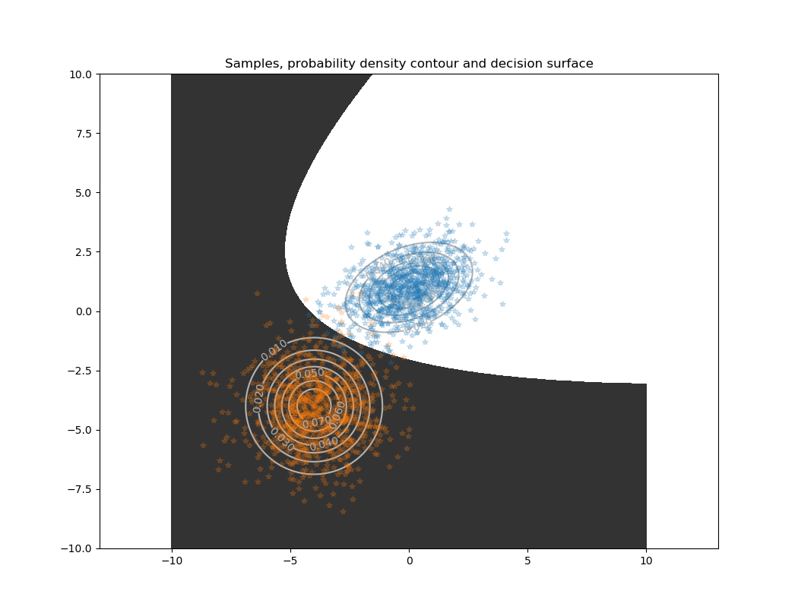
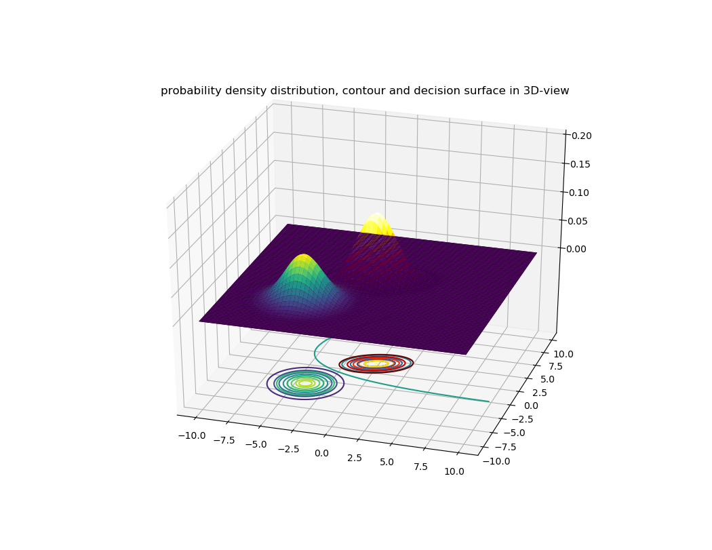

### hyperbola (双曲线)

* mean and covariance pairs for two distributions
```python
mu1 = np.array([0., 1.])
Sigma1 = np.array([[ 2. , 0], [0,  1.]])
mu2 = np.array([-3, 5.])
Sigma2 = np.array([[ 1. , 0], [0,  2.]])
```
* the decision line, decision surface and corresponding 3D viewing

|    |
|:--:|
| *Hyperbola* |

### parabola (抛物线)

* mean and covariance pairs for two distributions
```python
mu1 = np.array([0., 1.])
Sigma1 = np.array([[ 2. , 0.5], [0.5,  1.]])
mu2 = np.array([-4, -4.])
Sigma2 = np.array([[ 2. , 0], [0,  2.]])
```

* the decision line, decision surface and corresponding 3D viewing

|    |
|:--:|
| *Parabola* |

### ellipse (椭圆)

* mean and covariance pairs for two distributions
```python
mu1 = np.array([0., 1.])
Sigma1 = np.array([[ 0.8 , 0.3], [0.3,  0.8]])
mu2 = np.array([-4, -4.])
Sigma2 = np.array([[ 2. , 1], [1,  2.]])
```

* the decision line, decision surface and corresponding 3D viewing

|    |
|:--:|
| *Ellipse* |


### circle (圆)

* mean and covariance pairs for two distributions
```python
mu1 = np.array([0., 1.])
Sigma1 = np.array([[ 0.5 , 0], [0,  0.5]])
mu2 = np.array([-4, -4.])
Sigma2 = np.array([[ 2. , 0], [0,  2.]])
```

* the decision line, decision surface and corresponding 3D viewing

|    |
|:--:|
| *Circle 1* |


* mean and covariance pairs for two distributions
```python
mu1 = np.array([0., 1.])
Sigma1 = np.array([[ 1. , 0], [0,  1.]])
mu2 = np.array([-4, -4.])
Sigma2 = np.array([[ 2. , 0], [0,  2.]])
```

* the decision line, decision surface and corresponding 3D viewing

|    |
|:--:|
| *Circle 2* |

### line (直线)

* mean and covariance pairs for two distributions
```python
mu1 = np.array([0., 1.])
Sigma1 = np.array([[ 1 , 0], [0,  1]])
mu2 = np.array([-4, -4.])
Sigma2 = np.array([[ 1 , 0], [0,  1]])
```

* the decision line, decision surface and corresponding 3D viewing

|    |
|:--:|
| *Line 1* |

* mean and covariance pairs for two distributions
```python
mu1 = np.array([2., 2.])
Sigma1 = np.array([[ 1 , 0], [0,  3]])
mu2 = np.array([-2, -2.])
Sigma2 = np.array([[ 3 , 0], [0,  1]])
```

* the decision line, decision surface and corresponding 3D viewing

|    |
|:--:|
| *Line 2* |
